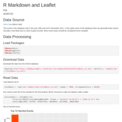
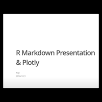
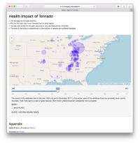
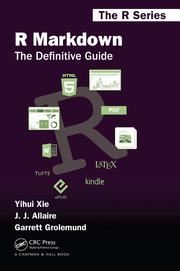

# Developing-Data-Products
Developing Data Products | Coursera

## Developments

- `RMarkdownAndLeaflet`

      
    [R Markdown and Leaflet - Developing Data Products | Coursera](http://rpubs.com/dr_orange_jr/406210)  
    Peer-graded Assignment: R Markdown and Leaflet

- `RMarkdownPresentationAndPlotly`

      
    [R Markdown Presentation & Plotly - Developing Data Products | Coursera](http://rpubs.com/dr_orange_jr/406293)  
    Peer-graded Assignment: R Markdown Presentation & Plotly

- `ShinyApplicationAndReproduciblePitch`

      
    [Shiny Application and Reproducible Pitch - Developing Data Products | Coursera](http://rpubs.com/dr_orange_jr/406377)  
    Peer-graded Assignment: Course Project: Shiny Application and Reproducible Pitch

      
    [Health Impact Of Tornado App](https://dr-orange-jr.shinyapps.io/HealthImpactOfTornadoApp/)  
    Shiny application

## References

- course text

      
    Developing Data Products in R

- [shinyapps.io by RStudio](http://www.shinyapps.io)

    Share your Shiny Applications Online  
    Deploy your Shiny applications on the Web in minutes

- [Rpubs brought to you by RStudio](http://rpubs.com)

    Easy web publishing from R  
    Write R Markdown documents in RStudio.  
    Share them here on RPubs. (It's free, and couldn't be simpler!)

- R Packages
    - `leaflet`: [an open-source JavaScript library
for mobile-friendly interactive maps](https://leafletjs.com)
        - [Leaflet for R](https://rstudio.github.io/leaflet/)
        - [Using Leaflet with Shiny](https://rstudio.github.io/leaflet/shiny.html)
    - `shiny`: [Interact. Analyze. Communicate.](http://shiny.rstudio.com)
    - `plotly`: [Modern Visualization for the Data Era](https://plot.ly)
        - [Plotly ggplot2 Library](https://plot.ly/ggplot2/)

- [R Markdown: The Definitive Guide](https://bookdown.org/yihui/rmarkdown/)

    

- [ioslides presentation](https://bookdown.org/yihui/rmarkdown/ioslides-presentation.html)
